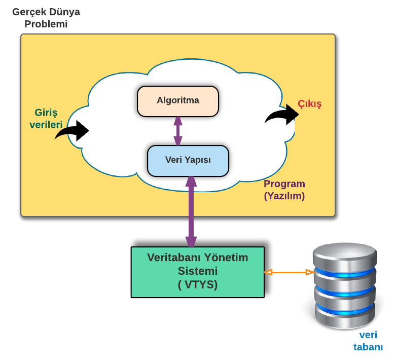
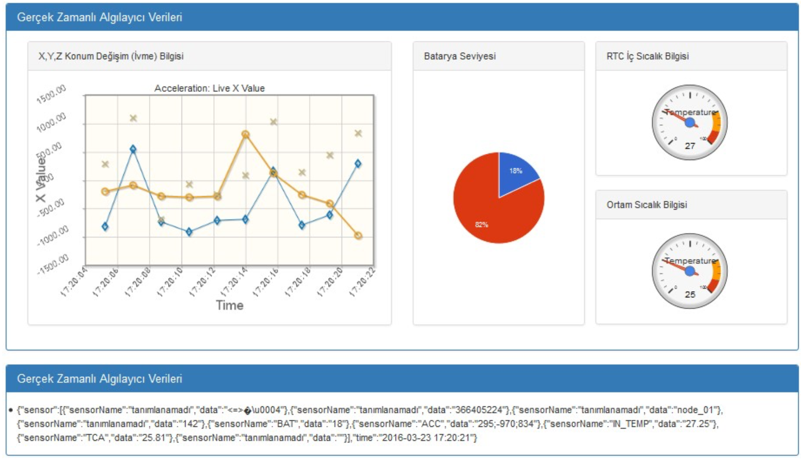
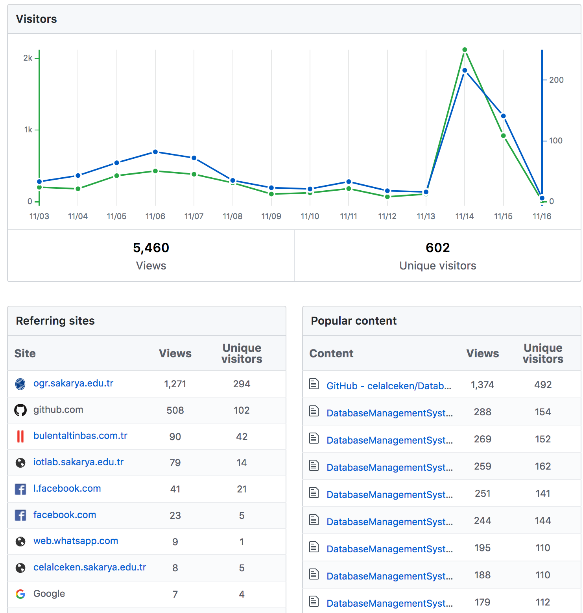
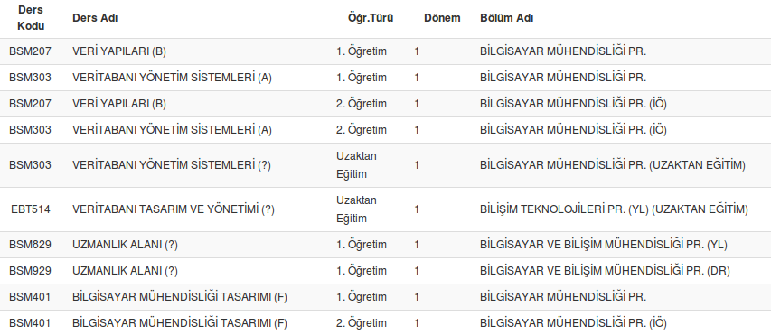
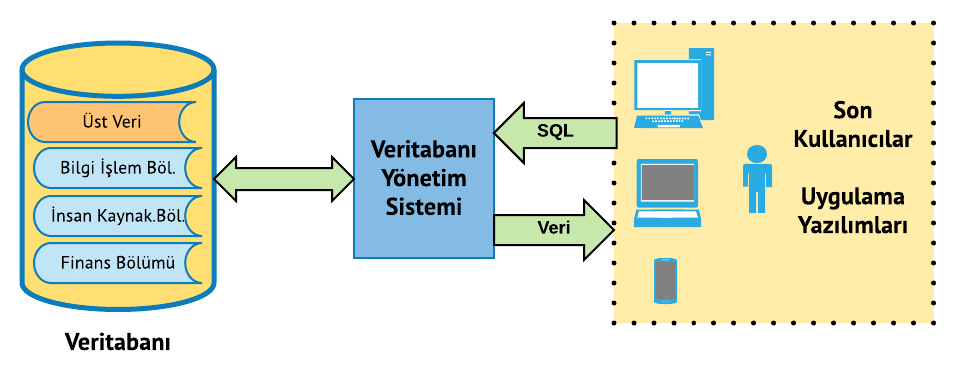
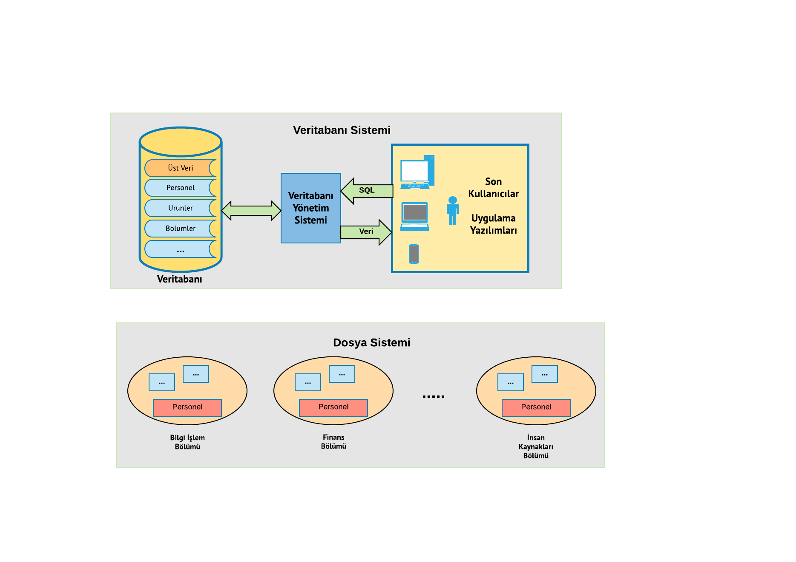

# Veritabanı Kavramı - Veritabanı Sistemleri

## Konular

* Büyük Resim
* Ders Tanıtımı
* Niçin Veritabanı?
* Veri ve Bilgi Kavramları
* Klasik Dosya Yapıları
* Klasik Dosya Sistemlerinin Zayıflıkları
* Veritabanı Sistemi
* Veritabanı Sistemi Ortamı
* Veritabanı Yönetim Sistemi Kullanmanın Yararları VTYS ile Dosya Sisteminin Karşılaştırılması
* Örnek Bir Veritabanı
* Veritabanı Sınıfları
* Kaynaklar


## Büyük Resim




## Ders Tanıtımı

* Ders hakkında EBS üzerinden bilgi alabilirsiniz.
* https://ebs.sabis.sakarya.edu.tr


## Niçin Veritabanı

* Dosyalarda depolanan birbiriyle ilişkili veri topluluklarına veri tabanı denir .
* Günümüz verileri; terabayt (1024 gigabayt), petabayt, ekzabayt, zetabayt, yotabayt boyutlarında.
* Google, saniyede ortalama 40.000 aramayı işliyor (günlük ortalama 3,5 milyar, toplam günlük arama 5 milyar. Arama sonuçlarının hızlı bir şekilde kullanıcıya getirilmesi sağlanabiliyor. (2018)
* Facebook kullanıcı sayısı 2 milyar. Günlük ortalama 1,5 milyar kullanıcı aktif. (2018)
* Her dakika; 4.146.600 YouTube videosu izleniyor, 456.000 tweet atılıyor, Instagram’a 46.740 fotoğraf yükleniyor, Facebook’a 510.000 yorum ekleniyor. (2018)
* Sprint, AT&T gibi mobil telefon operatörleri trilyonlarca konuşmayı saklamak/yönetmek zorundadır. Saniyede 70.000 konuşma eklenmektedir. (2007)
* Bu verilerin saklanması/yönetilmesinin yanı sıra istenen bilgiye hızlı bir şekilde ulaşılması da gereklidir.
* Bir jet uçağı 30 dakikada 10 terabaytlık algılayıcı verisi topluyor. (2012)
* Nesnelerin interneti. 2020 yılında 50 milyar (bazı kaynaklara göre 200 Milyar) algılayıcının internete bağlanacağı öngörülüyor.
* Bu kadar büyük boyuttaki verilerin saklanması, yönetilmesi ve hızlı bir şekilde istenen bilgilere ulaşılabilmesi için veritabanlarının kullanımı zorunludur.
* Veritabanı, günümüzde birçok farklı sektörde ve kurumda yaygın olarak kullanılmaktadır.
  + Finans
  + Eğitim
  + Ulaşım
  + Taşımacılık
  + İletişim
  + Medya
  + Sağlık
  + Bilişim
  + Üretim


## Veri ve Bilgi Kavramları

* İşlenerek anlam kazandırılmamış ham gerçeklere veri denir.
* Veriler işlenerek bilgi oluşturulur
* Bilgi, verinin anlamını göstermek için kullanılır.
* Doğru, ilgili ve zamanında elde edilebilen bilgi, karar verme süreçlerinde çok etkilidir.
* Doğru karar verme, kuruluşların yaşamını sürdürebilmesi açısından son derece önemlidir.
* Veri yönetimi, organizasyonların en temel aktivitelerindendir. 
* **Veri yönetimi** verinin uygun bir şekilde üretimi, saklanması ve erişilmesiyle ilgilenen disiplindir.






## Klasik Dosya Yapısı

* Veriler, kayıtlar halinde klasik dosya yapısı kullanılarak saklanır. 
* Örnek bir dosya yapısı aşağıda verilmiştir.




## Veritabanı Sistemi

* Veritabanı Sistemi = Veritabanı + VTYS + Kullanıcılar
* Dosyalarda depolanan birbiriyle ilişkili veri topluluklarına veritabanı denir .
  + Veritabanı = HamVeri + ÜstVeri/Metadata (İlişkiler+Veri Karakteristikleri)
* Veritabanı yapısını yöneten ve verilere erişimi sağlayan yazılımlara Veritabanı Yönetim Sistemi adı verilir.




## Veritabanı Sistemi Ortamı

* Donanım
  + Suncular, iş istasyonları, ağ ortamı, depolama cihazları, raid vb.
* Yazılım
  + İşletim Sistemleri
  + VTYS (Oracle, PostgreSQL, DB2, MSSQL, MySQL vb.)
  + Uygulama programları ve yardımcı programlar
* Kişiler
  + Sistem yöneticisi, veritabanı yöneticisi, veritabanı tasarımcısı, uygulama programcısı, kullanıcı
* Veri


## Veritabanı Yönetim Sistemi Kullanmanın Yararları
### VTYS ile Dosya Sisteminin Karşılaştırılması

* **Veri Tümleştirme (Data Integration):** Verilerin tekrarsız olarak etkin bir şekilde saklanması garanti edilebilir.
* **Veri Bütünlüğü (Data Integrity):** Verilerin bozulmadan ve tutarlı olarak saklanması sağlanabilir. Kısıtlar eklenerek veri tutarsızlığı önlenebilir (key constraints, integrity rules).
* **Veri Güvenliği (Data Security):** Sistem hataları karşısında ya da saldırıya rağmen verilerin kaybolmaması ve tutarlılığının korunması sağlanabilir (transaction, raid sistemler, kurtarma mekanizmaları, gelişmiş yetkilendirme yapısı vb.).
* **Veri Soyutlama (Data Abstraction):** Kullanıcıya, karmaşık yapıdaki fiziksel veri yapısı yerine anlaşılabilirliği ve yönetilebilirliği daha kolay olan mantıksal model sunulur.





### VTYS ile Dosya Sisteminin Karşılaştırılması

*Klasik dosyadan okuma işlemi (http://www.cplusplus.com)


* VTYS (SQL) ile okuma işlemi

```sql
SELECT * FROM Ogrenciler;
```


##  Örnek Bir Veritabanı (Varlık Bağıntı Modeli)


##  Örnek Bir Veritabanı (İlişkisel Model)


## Veritabanı Sınıfları

* Kullanım Amacı
  + **Operasyonel:** Veriler üzerinde sürekli değişiklikler yapılır. (OLTP: Online Transaction Processing)
  + **Veri Ambarı:** Veriler raporlama ve karar destek amaçlarıyla kullanılır. (OLAP: Online Analytical Processing)


