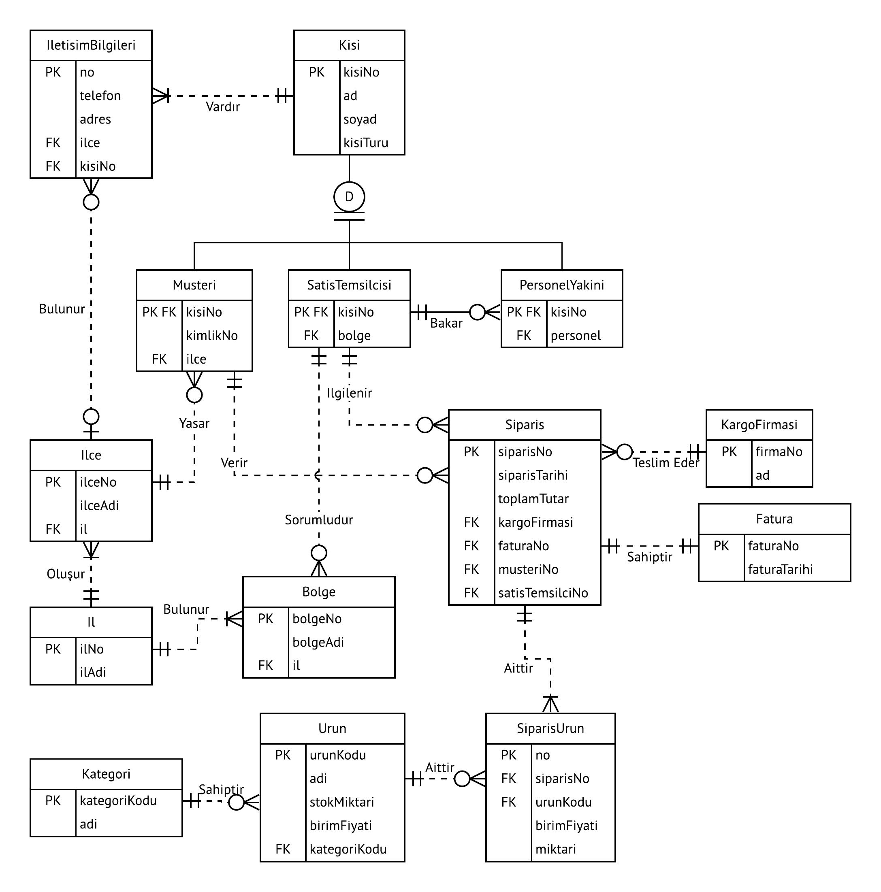
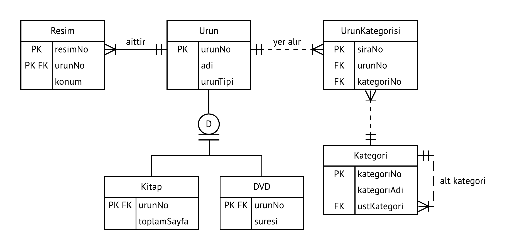
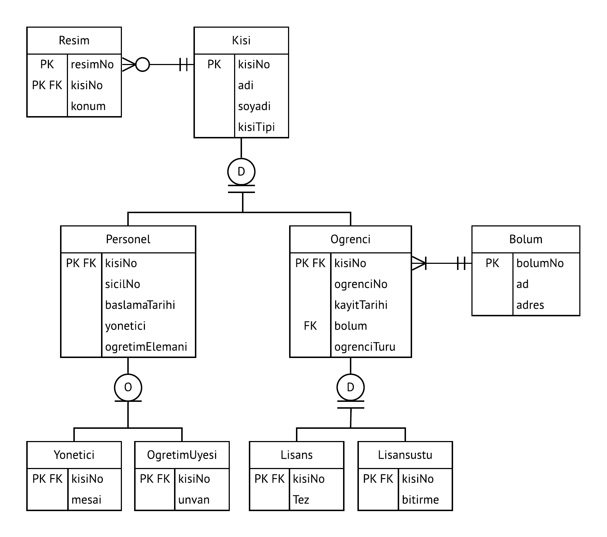
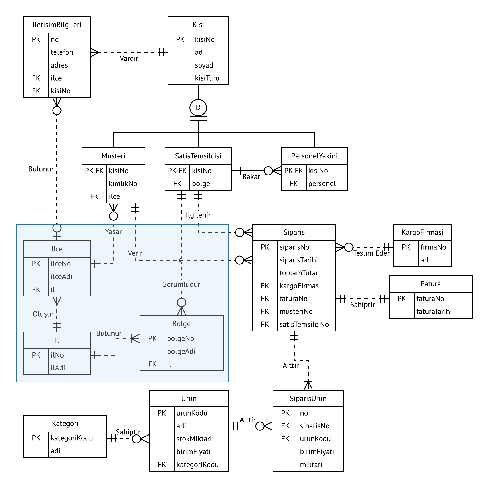
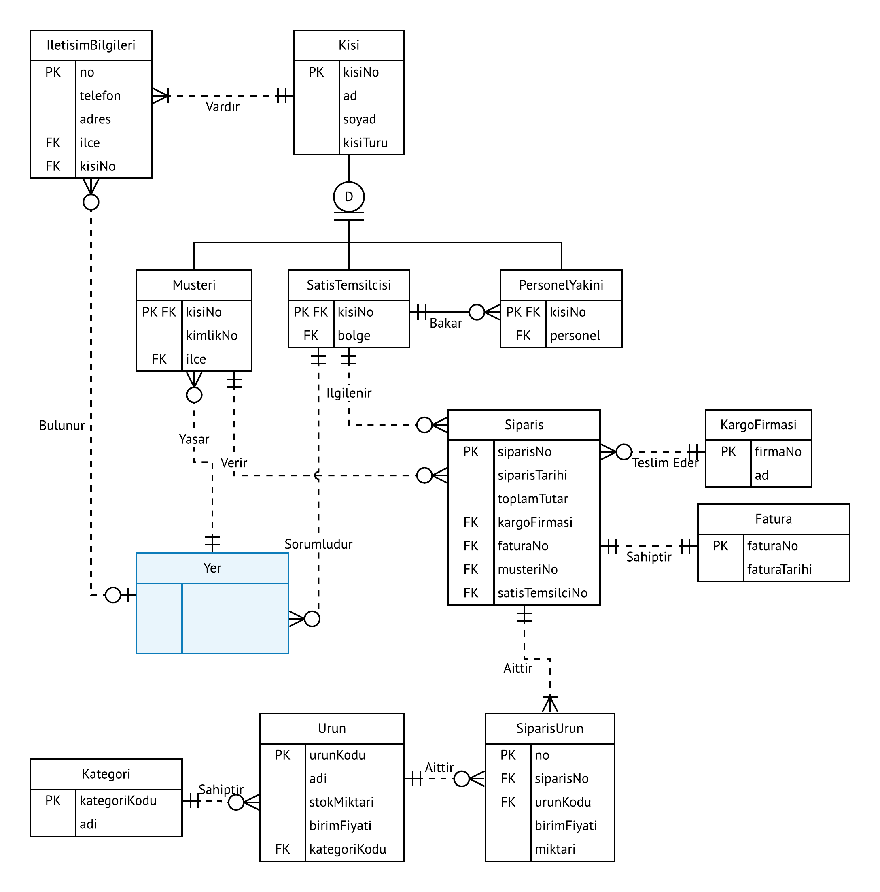

BSM211 Veritabanı Yönetim Sistemleri - Celal ÇEKEN, İsmail ÖZTEL, Veysel Harun ŞAHİN

# Genişletilmiş Varlık Bağıntı Modeli

## Konular

* Genelleme (Kalıtım)
* Kümeleme

## Genelleme

* Bir veritabanı içerisinde benzer özelliklere sahip varlıklar için ortak alanları içeren temel bir varlık oluşturulabilir ve diğer varlıklar bu temel varlıktan türetilebilir.
* Bunun çeşitli avantajları vardır.
  * Hızlı tasarım
  * Değişikliklerin kolay yapılabilmesi
  * Anlaşılabilirliğin artması vb.
* NYP paradigmasındaki kalıtımın sağladığı avantajların çoğu sağlanır.

### Temel Kavramlar

* **Çakışan/Overlap (O):** Aynı anda birden fazla çocuk varlık olabilir
  * Örneğin bir kişinin aynı anda hem personel hem öğrenci olabilmesi.
* **Ayrık/Disjoint (D):** Aynı anda sadece bir çocuk varlık olabilir.
  * Örneğin bir öğrencinin aynı anda ya lisans öğrencisi ya da yüksek lisans öğrencisi olabilmesi.
* **Kısmi Bütünlük/Partial Completeness (Tek Çizgi):** Üst tip (supertype) kayıtlar, alt tip (subtype) kayıtlar olmadan da mevcut olabilir.
* **Toplam Bütünlük/Total Completeness (Çift Çizgi)**:** Her üst tip (supertype) kaydın, mutlaka en az bir alt tip (subtype) kaydı olmalı.

### Örnek 1

### Örnek 2

### Örnek 3

## Kümeleme

* VB diyagramlarını basitleştirmek ve okunabilirliğini artırmak için, çok sayıda varlık ve bağıntıları yerine kullanılan sanal varlığa varlık kümesi denir.

## Kaynaklar

* Carlos Coronel, Steven Morris, and Peter Rob, Database Systems: Design, Implementation, and 	Management, Cengage Learning.
