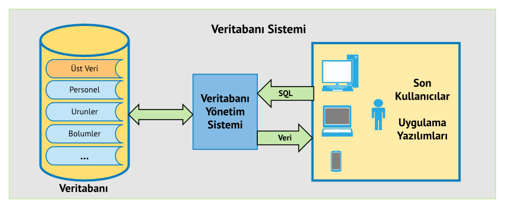
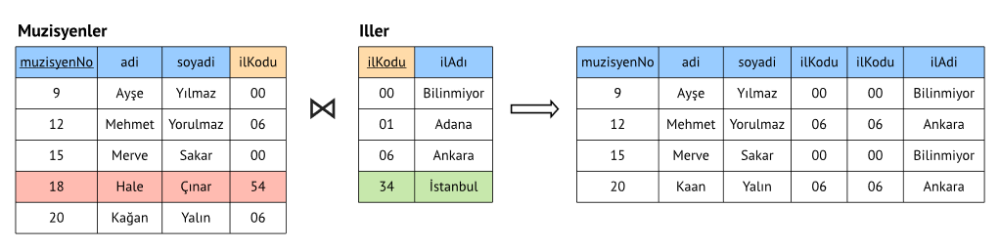
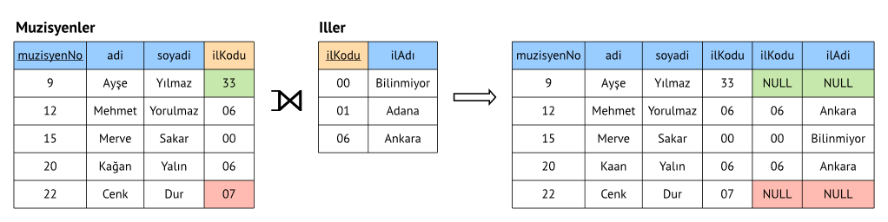
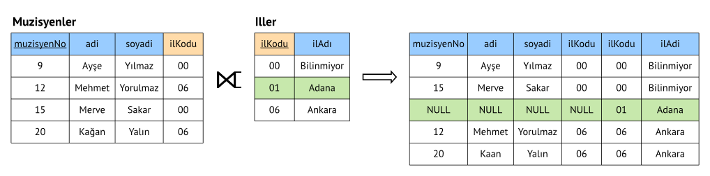

BSM211 Veritabanı Yönetim Sistemleri - Celal ÇEKEN, İsmail ÖZTEL, Veysel Harun ŞAHİN

# Yapısal Sorgulama Dili (Structured Query Language, SQL)

## Konular

* Çalışma Ortamının Hazırlanması
* Yapısal Sorgulama Dili (Structured Query Language, SQL)
* Temel SQL Komutları (SQL DML Komutları; SELECT, JOIN, INSERT, UPDATE, DELETE) 
* Uygulama Programları ile VYS İşlemleri

## Çalışma Ortamının Hazırlanması

* PostgreSQL kurulumu
  + PostgreSQL 11.x
  + https://www.postgresql.org/download
* pgAdmin kurulumu
  + pgAdmin 4
  + PostgreSQL ile dağıtılıyor.
* Valentina Studio
  + https://www.valentina-db.com/en/valentina-studio-overview
* NorthWind veritabanının içe aktarılması, dışa verilmesi
  + https://code.google.com/archive/p/northwindextended/downloads
* Pagila veritabanının içe aktarılması, dışa verilmesi
  + http://www.postgresqltutorial.com/postgresql-sample-database

## Yapısal Sorgulama Dili (SQL)

* SQL Fonksiyonları 2 bölüme ayrılabilir:
* Veri Tanımlama Dili (Data Definition Language, DDL)
  + Yapısal Komutlar
  + Veritabanı, tablo, ilişki vs. oluşturma, değiştirme, silme vs.
* Veri İşleme Dili (Data Manipulation Language, DML)
  + Veri ekleme, silme, güncelleme, sorgulama vs.

## Temel SQL Komutları (SQL DML Komutları; SELECT, JOIN, INSERT, UPDATE, DELETE) 

* Aşağıdaki sorgular NorthWind Örnek Veritabanını Kullanmaktadır.

## SELECT

* Select Komutu veritabanından veri almak (arama/listeleme) için kullanılır.

~~~sql
SELECT * FROM "customers";

SELECT "CompanyName", "ContactName" FROM "customers";
~~~

## WHERE

* İstenilen koşula uyan kayıtların listelenmesi için WHERE komutu kullanılır.

~~~sql
SELECT * FROM "customers" WHERE "Country" = 'Argentina';

SELECT * FROM "customers" WHERE "Country" != 'Brazil';

SELECT * FROM "customers" WHERE "Country"='Argentina' AND "City" = 'Buenos Aires';

SELECT * FROM "customers" WHERE "Country" = 'Türkiye' OR "Country" = 'Japan';

SELECT * FROM "order_details" WHERE "UnitPrice" = 14;

SELECT * FROM "order_details" WHERE "UnitPrice" < 14;

SELECT * FROM "order_details" WHERE "UnitPrice" <= 14;

SELECT * FROM "order_details" WHERE "UnitPrice" >= 14;

SELECT * FROM "order_details" WHERE "UnitPrice" > 14;
~~~

### DISTINCT 
* Tabloda bazı sütunlar tekrar eden kayıtlar içerebilir. “DISTINCT” ifadesi
sorgu sonucu gelen değerler içerisindeki tekrarlanan kayıtların tek kayıt
olarak gösterilmesini sağlar.

~~~sql
SELECT DISTINCT "City" from "customers";
~~~

### ORDER BY
* Sorgular sonucunda listelenen kayıtların belirli alanlara göre alfabetik 
veya sayısal olarak artan ya da azalan şeklinde sıralanması için 
"ORDER BY" komutu kullanılır.

~~~sql
SELECT * FROM "customers" ORDER BY "ContactName" ASC;

SELECT * FROM "customers" ORDER BY "ContactName" DESC;

SELECT * FROM "customers" ORDER BY "ContactName" DESC, "CompanyName";

SELECT * FROM "customers" ORDER BY "Country", "ContactName";
~~~

### LIKE 

~~~sql

SELECT * FROM "customers" WHERE "Country" LIKE '%pa%';

SELECT * FROM "customers" WHERE "Country" LIKE '_razil';

SELECT * FROM "customers" WHERE "City" LIKE 'Sao _aulo';

SELECT * FROM "customers" WHERE "Country" LIKE '%pa_';
~~~

### BETWEEN

~~~sql
SELECT * FROM "products" WHERE "UnitPrice" BETWEEN 10 AND 20;

SELECT * FROM "products" WHERE "ProductName" BETWEEN 'C' AND 'M';
~~~

### IN

~~~sql
SELECT * FROM "customers" 
  WHERE "public"."customers"."Country" IN ('Türkiye', 'Kuzey Kıbrıs Türk Cumhuriyeti');
~~~

### NULL ve NULL olmayan içeriğe sahip alanların sorgulanması.

~~~sql
SELECT * FROM "customers" WHERE "Region" IS NOT NULL;

SELECT * FROM "customers" WHERE "Region" IS NULL;
~~~

### AS
* AS ifadesi ile alanlara takma isim verilir.

~~~sql
SELECT "CompanyName" AS "musteriler" FROM "customers";

SELECT "UnitPrice", "UnitPrice" * 1.18 AS "KDVliTutar" FROM "products";

SELECT "OrderID" AS "siparisNo",
       "ShipPostalCode" || ',' || "ShipAddress" AS "gonderiAdresi"
FROM "orders"
WHERE "OrderDate" BETWEEN '07/04/1996' AND '07/09/1996';
~~~

## TABLO BİRLEŞTİRME İŞLEMLERİ

* Birleştirme (join) işlemi, farklı tablolardaki kayıtları birleştirip yeni veri kümeleri oluşturmak için kullanılır.

### Doğal/İç Birleştirme (Natural/Inner Join)

~~~sql
SELECT * FROM "Muzisyenler" INNER JOIN "Iller"
  ON "Muzisyenler"."ilKodu" = "Iller"."ilKodu"
~~~

~~~sql
SELECT 
  "public"."orders"."OrderID",
  "public"."customers"."CompanyName",
  "public"."customers"."ContactName",
  "public"."orders"."OrderDate"
FROM "orders" 
INNER JOIN "customers" ON "orders"."CustomerID" = "customers"."CustomerID" 
~~~

~~~sql
SELECT 
  "public"."orders"."OrderID",
  "public"."customers"."CompanyName",
  "public"."customers"."ContactName",
  "public"."orders"."OrderDate"
FROM "orders" 
INNER JOIN "customers"  ON "orders"."CustomerID" = "customers"."CustomerID"
WHERE "public"."customers"."Country" LIKE 'A%'
ORDER BY "public"."customers"."CompanyName" DESC;
~~~

~~~sql
SELECT 
  "orders"."OrderID" AS "siparisNo",
  "customers"."CompanyName" AS "sirket",
  "orders"."OrderDate" AS "siparisTarihi"
FROM "orders"
INNER JOIN "customers" ON "orders"."CustomerID" = "customers"."CustomerID";
~~~

* Aşağıdaki kullanım biçimi de INNER JOIN gibidir.

~~~sql
SELECT 
  "orders"."OrderID" AS "siparisNo",
  "customers"."CompanyName" AS "sirket",
  "orders"."OrderDate" AS "siparisTarihi"
FROM "orders", "customers"
WHERE "orders"."CustomerID" = "customers"."CustomerID"
ORDER BY "customers"."CompanyName" DESC;
~~~

~~~sql
SELECT 
  "orders"."OrderID",
  "orders"."OrderDate",
  "customers"."CompanyName",
  "employees"."FirstName",
  "employees"."LastName"
FROM "orders"
INNER JOIN "customers" ON "orders"."CustomerID" = "customers"."CustomerID"
INNER JOIN "employees" ON "orders"."EmployeeID" = "employees"."EmployeeID";
~~~

~~~sql
SELECT
  "orders"."OrderID",
  "products"."ProductName"
FROM "order_details"
INNER JOIN "orders" ON "order_details"."OrderID" = "orders"."OrderID"
INNER JOIN "products" ON "order_details"."ProductID" = "products"."ProductID";
~~~

### Sol Dış Birleştirme (Left Outer Join)

~~~sql
SELECT * FROM "Muzisyenler" LEFT OUTER JOIN "Iller"
  ON "Muzisyenler"."ilKodu" = "Iller"."ilKodu"
~~~

~~~sql
SELECT
  "orders"."OrderID" AS "siparisNo",
  "customers"."CompanyName" AS "sirket",
  "orders"."OrderDate" AS "siparisTarihi"
FROM "customers"
LEFT OUTER JOIN "orders" ON "orders"."CustomerID" = "customers"."CustomerID" 
ORDER BY "OrderID" DESC;
~~~

### Sağ Dış Birleştirme (Right Outer Join)

~~~sql
SELECT * FROM "Muzisyenler" RIGHT OUTER JOIN "Iller"
  ON "Muzisyenler"."ilKodu" = "Iller"."ilKodu"
~~~

~~~sql
SELECT
  "orders"."OrderID" AS "siparisNo",
  "employees"."FirstName" AS "satisTemsilcisiAdi",
  "employees"."LastName" AS "satisTemsilcisiSoyadi",
  "orders"."OrderDate" AS "siparisTarihi"
FROM "orders"
RIGHT OUTER JOIN "employees" ON "orders"."EmployeeID" = "employees"."EmployeeID" 
ORDER BY "OrderID" DESC;
~~~

~~~sql
INSERT INTO "employees" ("EmployeeID","FirstName", "LastName") 
  VALUES (10,'Melih', 'Can');
~~~

## SELECT ... INTO
* Bir tablodan alınan verileri, yeni bir tabloya kopyalamak için kullanılır. 
* Yeni tablonun mevcut olmaması gerekir.

~~~sql
SELECT "CompanyName", "ContactName" INTO "MusteriYedek" FROM "customers";
~~~

## INSERT
* INSERT komutu tabloya yeni kayıt eklemek için kullanılır. 
* Ekleme işlemlerinde veri bütünlüğü kısıtları göz önüne alınır.
* Yalnızca bazı sütunlara veri eklememiz mümkündür. 
* Veri eklenmeyen sütunlar NULL (boş) gözükecektir.

~~~sql
INSERT INTO "customers" 
("CustomerID", "CompanyName", "ContactName","Address", "City", "PostalCode", "Country")
VALUES ('ZZA', 'Zafer', 'Ayşe', 'Serdivan', 'Sakarya', '54400', 'Türkiye');
~~~

## INSERT INTO ... SELECT
* Bir tablodan alınan verileri, varolan bir tabloya kopyalamak için kullanılır.

~~~sql
INSERT INTO "MusteriYedek" SELECT "CompanyName", "ContactName" FROM "customers";
~~~

## UPDATE 
* UPDATE komutu tablodaki kayıt(lar)ın değiştirilmesini sağlar.
* Güncelleme işlemlerinde veri bütünlüğü kısıtları göz önüne alınır.

~~~sql
UPDATE "customers" SET "ContactName" = 'Mario Pontes', "City" = 'Rio de Janeiro' 
WHERE "CompanyName" = 'Familia Arquibaldo';
~~~

* WHERE ifadesi kullanılmazsa tüm satırlar değiştirilir.

## DELETE
* DELETE ifadesi tablodaki kayıt veya kayıtların silinmesini sağlar.
* Silme işlemlerinde veri bütünlüğü kısıtları göz önüne alınır.

~~~sql
DELETE FROM "customers" 
WHERE "CompanyName" = 'LINO-Delicateses' AND "ContactName" = 'Felipe Izquierdo';
~~~

* Tabloyu silmeden tablodaki bütün kayıtları silmek mümkündür. 
* Aşağıdaki komut tablodaki bütün kayıtları silmeye yarar.

~~~sql
DELETE FROM "customers";
~~~
# Uygulama Programları ile VYS İşlemleri

Uygulama programları ile veritabanı işlemleri yapılabilmesi için, programlama dili ile kullanılan veritabanı arasında iletişimi sağlayacak sürücülere ihtiyaç vardır.

PostgreSQL jdbc sürücüsü https://jdbc.postgresql.org/download.html bağlantısından indirilebilir.

Sürücüler aşağıdaki temel fonksiyonları sağlar:

* bağlantı kurulumu
* sorgu çalıştırma
* bağlantı sonlandırma

Aşağıdaki Java kodunun uygulanmasına yardımcı olabilecek örnek bir video https://youtu.be/aPEx1RexoCY bağlantısından izlenebilir.

~~~java
package edu.sau.vys.vys1;

/***** Veritabanı sürücüsü *****/
import java.sql.*;

public class VeritabaniIslemleri {

    public static void main(String[] args)
    {
        try
        {   /***** Bağlantı kurulumu *****/
            Connection conn = DriverManager.getConnection("jdbc:postgresql://localhost:5432/Northwind",
                    "postgres", "LecturePassword");
            if (conn != null)
                System.out.println("Veritabanına bağlandı!");
            else
                System.out.println("Bağlantı girişimi başarısız!");

            String sql= "SELECT \"CustomerID\", \"CompanyName\", \"Country\"  FROM \"customers\"";

            /***** Sorgu çalıştırma *****/
            Statement stmt = conn.createStatement();
            ResultSet rs = stmt.executeQuery(sql);

            String musteriNo= null;
            String sirketAdi=null;
            String ulke;

            while(rs.next())
            {
                /***** Kayda ait alan değerlerini değişkene ata *****/
                musteriNo  = rs.getString("CustomerID");
                sirketAdi = rs.getString("CompanyName");
                ulke = rs.getString("Country");

                /***** Ekrana yazdır *****/
                System.out.print("Sıra No:"+ musteriNo);
                System.out.print(", Şirket Adı:" + sirketAdi);
                System.out.println(", Ulke:" + ulke);
            }
            /***** Kaynakları serbest bırak *****/

            rs.close();
            stmt.close();

            /***** Bağlantı sonlandırma *****/
            conn.close();
        } catch (Exception e) {
            e.printStackTrace();
        }
    }
}
~~~

* .NET ile Postgresql bağlantısını sağlayabilmek için linkteki dökümandan faydalanabilirsiniz.

[.NET & Postgresql](https://github.com/celalceken/DatabaseManagementSystems/blob/master/Open%20Database%20Connectivity/.NET_Postgres_connection.pdf)
