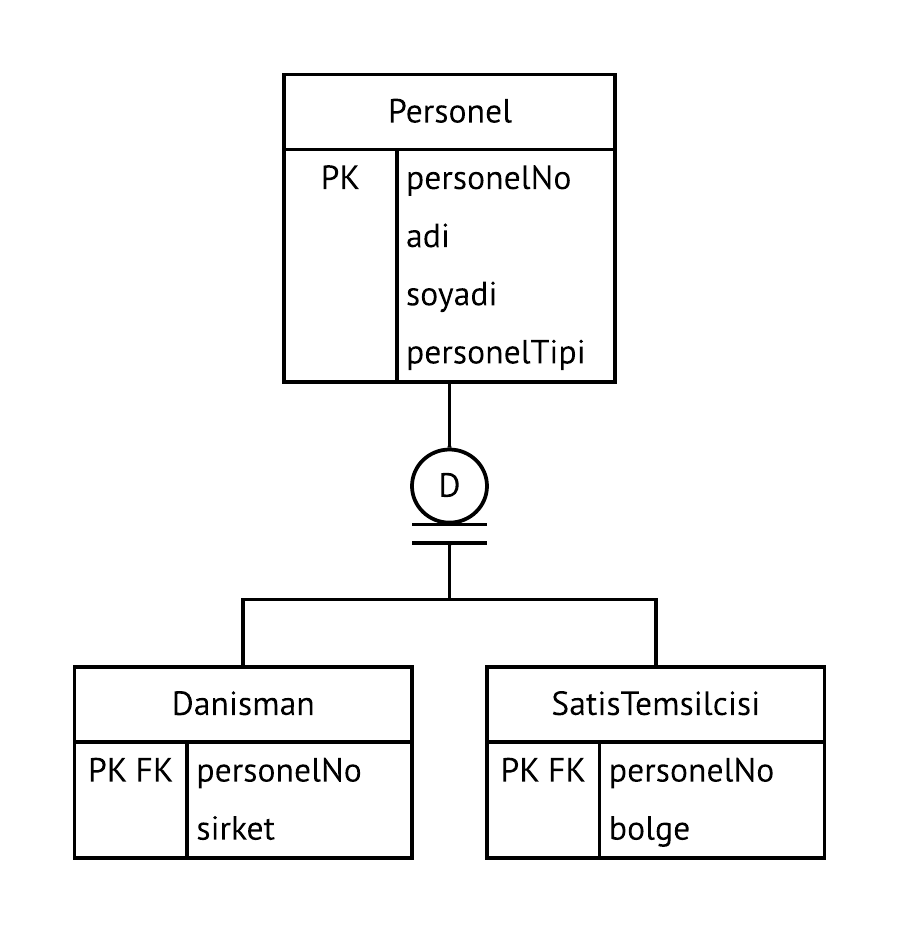
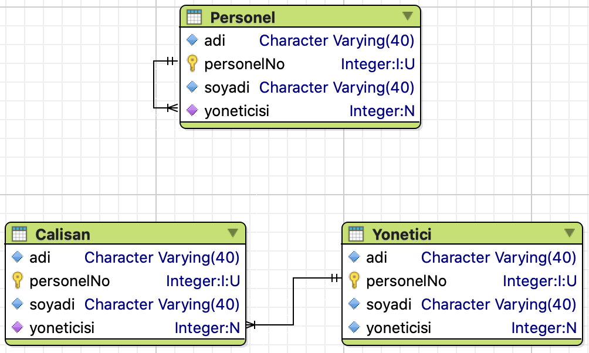

BSM211 Veritabanı Yönetim Sistemleri - Celal ÇEKEN, İsmail ÖZTEL, Veysel Harun ŞAHİN

# Temel SQL (SQL DDL Komutları; İndeks (Index), Kalıtım, Tekli Bağıntı, SQL DML Komutları; Görünüm (View), Çoklu Satır Fonksiyonları, Gruplama) 

## Konular

* İndeks (Index)
* Kalıtım
* Tekli Bağıntı / Özyineli Birleştirme
* Görünüm (View)
* Çoklu Satır Fonksiyonları
* Gruplama

## İndeks
* Ayrıntılar için https://github.com/celalceken/DatabaseManagementSystems/blob/master/VYS04.md bağlantısına bakınız.
~~~sql
CREATE TABLE "Musteriler" (
	"musteriNo" SERIAL NOT NULL,
	"adi" CHARACTER VARYING(40) COLLATE "pg_catalog"."default" NOT NULL,
	"soyadi" CHARACTER VARYING(40) COLLATE "pg_catalog"."default" NOT NULL,
	CONSTRAINT "musteriNoPK" PRIMARY KEY ("musteriNo")
);
~~~

~~~sql
SHOW lc_collate;
~~~

~~~sql
CREATE INDEX "musterilerAdiIndex" ON "Musteriler" ("adi");
~~~

~~~sql
CREATE INDEX "musterilerSoyadiIndex" ON "Musteriler" USING btree ("soyadi");
~~~

~~~sql
DROP INDEX "musterilerAdiIndex";
~~~

### Örnek Uygulama 

* Örnek Ek Veritabanı

~~~sql
CREATE DATABASE "TestVeritabani"
ENCODING='UTF-8'
LC_COLLATE='tr_TR.UTF-8'
LC_CTYPE='tr_TR.UTF-8'	
OWNER postgres
TEMPLATE=template0;

CREATE TABLE "Kisiler" (
    "kisiNo" SERIAL,
	"adi" VARCHAR(40) NOT NULL,
	"soyadi" VARCHAR(40) NOT NULL,
	"kayitTarihi" TIMESTAMP DEFAULT '2019-01-01 01:00:00',
	CONSTRAINT "urunlerPK1" PRIMARY KEY("kisiNo")
);
~~~

* Windows işletim sistemi için:

~~~sql
CREATE DATABASE "TestVeritabani"
ENCODING='UTF-8'
LC_COLLATE='Turkish_Turkey.1254'
LC_CTYPE='Turkish_Turkey.1254'	
OWNER postgres
TEMPLATE=template0;

CREATE TABLE "Kisiler" (
    "kisiNo" SERIAL,
	"adi" VARCHAR(40) NOT NULL,
	"soyadi" VARCHAR(40) NOT NULL,
	"kayitTarihi" TIMESTAMP DEFAULT '2019-01-01 01:00:00',
	CONSTRAINT "urunlerPK1" PRIMARY KEY("kisiNo")
);
~~~

~~~sql
CREATE OR REPLACE FUNCTION "veriGir"(kayitSayisi integer)
RETURNS VOID
AS  
$$
BEGIN   
    IF kayitSayisi > 0 THEN
        FOR i IN 1 .. kayitSayisi LOOP
            INSERT INTO "Kisiler" ("adi","soyadi", "kayitTarihi") 
            VALUES(
                substring('ABCÇDEFGĞHIiJKLMNOÖPRSŞTUÜVYZ' from ceil(random()*10)::smallint for ceil(random()*20)::SMALLINT), 
                substring('ABCÇDEFGĞHIiJKLMNOÖPRSŞTUÜVYZ' from ceil(random()*10)::smallint for ceil(random()*20)::SMALLINT),
                NOW() + (random() * (NOW()+'365 days' - NOW()))
                 );
        END LOOP;
    END IF; 
END;
$$
LANGUAGE 'plpgsql'  SECURITY DEFINER;
~~~

~~~sql
SELECT "veriGir"(100000);
~~~

~~~sql
EXPLAIN ANALYZE
SELECT * FROM "Kisiler"
WHERE "adi"='DENEME';
-- Satırlardan birinin adi alanı "DENEME" olarak değiştirilmeli
~~~

  + Execution time: 10.274 ms

~~~sql
CREATE INDEX "adiINDEX" ON "public"."Kisiler" USING btree( "adi" Asc NULLS Last );
~~~

~~~sql
EXPLAIN ANALYZE
SELECT * FROM "Kisiler"
WHERE "adi"='DENEME';
-- Satırlardan birinin adi alanı "DENEME" olarak değiştirilmeli
~~~

  + Execution time: 0.086 ms

## Kalıtım

~~~sql
CREATE DATABASE "AlisVerisUygulamasi"
ENCODING='UTF-8'
LC_COLLATE='tr_TR.UTF-8'
LC_CTYPE='tr_TR.UTF-8'
OWNER postgres
TEMPLATE=template0;
~~~

* Windows işletim sistemi için:

~~~sql
CREATE DATABASE "AlisVerisUygulamasi"
ENCODING='UTF-8'
LC_COLLATE='Turkish_Turkey.1254'
LC_CTYPE='Turkish_Turkey.1254'	
OWNER postgres
TEMPLATE=template0;
~~~

~~~sql
CREATE SCHEMA "Personel";
~~~

~~~sql
CREATE TABLE "Personel"."Personel" ( 
	"personelNo" SERIAL,
	"adi" CHARACTER VARYING(40) NOT NULL,
	"soyadi" CHARACTER VARYING(40) NOT NULL,
	"personelTipi" CHARACTER(1) NOT NULL,
	CONSTRAINT "personelPK" PRIMARY KEY ("personelNo")
);
~~~

~~~sql
CREATE TABLE "Personel"."Danisman" ( 
	"personelNo" INT,
	"sirket" CHARACTER VARYING(40) NOT NULL,
	CONSTRAINT "danismanPK" PRIMARY KEY ("personelNo")
);
~~~

~~~sql
CREATE TABLE "Personel"."SatisTemsilcisi" ( 
	"personelNo" INT,
	"bolge" CHARACTER VARYING(40) NOT NULL,
	CONSTRAINT "satisTemsilcisiPK" PRIMARY KEY ("personelNo")
);
~~~

* Temel tablo ile çocuk tablo arasında bağıntı kurulumu. "CASCADE" kullanımının en uygun olduğu yer
~~~sql
ALTER TABLE "Personel"."Danisman"
	ADD CONSTRAINT "DanismanPersonel" FOREIGN KEY ("personelNo")
	REFERENCES "Personel"."Personel" ("personelNo")
	ON DELETE CASCADE
	ON UPDATE CASCADE;
~~~

* Temel tablo ile çocuk tablo arasında bağıntı kurulumu. "CASCADE" kullanımının en uygun olduğu yer
~~~sql
ALTER TABLE "Personel"."SatisTemsilcisi"
	ADD CONSTRAINT "SatisTemsilcisiPersonel" FOREIGN KEY ("personelNo")
	REFERENCES "Personel"."Personel" ("personelNo")
	ON DELETE CASCADE
	ON UPDATE CASCADE;
~~~

* Kalıtım kullanıldığında verilerin eklenmesi
~~~sql
INSERT INTO "Personel"."Personel"("adi","soyadi","personelTipi")
VALUES ('Mert','Şen','D' )

INSERT INTO "Personel"."Danisman"("personelNo","sirket")
VALUES (currval('"Personel"."Personel_personelNo_seq"'),'Şen Ltd.');
~~~

~~~sql
-- Fonksiyon tanımı içerisinde
$$
DECLARE personelNo integer;

BEGIN

INSERT INTO "Personel"."Personel"("adi","soyadi","personelTipi")
VALUES ('Mert','Şen','D' ) RETURNING "personelNo" INTO personelNo;

INSERT INTO "Personel"."Danisman"("personelNo","sirket")
VALUES (personelNo,'Şen Ltd.');

END 
$$;
~~~
* Kalıtım kullanıldığında verilerin alınması
~~~sql
SELECT * FROM "Personel"."Personel"
INNER JOIN "Personel"."SatisTemsilcisi"
ON "Personel"."Personel"."personelNo" = "Personel"."SatisTemsilcisi"."personelNo";
~~~

~~~sql
SELECT * FROM "Personel"."Personel"
INNER JOIN "Personel"."Danisman"
ON "Personel"."Personel"."personelNo" = "Personel"."Danisman"."personelNo";
~~~

* Sorguların hızlandırılması için temel tabloya eklenen alan
~~~sql
SELECT "adi", "soyadi" FROM "Personel"."Personel"
WHERE "personelTipi"='S';
~~~

~~~sql
SELECT "adi", "soyadi" FROM "Personel"."Personel"
WHERE "personelTipi"='D';
~~~

~~~sql
SELECT "adi", "soyadi" FROM "Personel"."Personel"
INNER JOIN "Personel"."Danisman"
ON "Personel"."personelNo" = "Danisman"."personelNo";
~~~

## Tekli Bağıntı / Özyineli Birleştirme

~~~sql
CREATE TABLE "Personel" (
	"personelNo" SERIAL,
	"adi" CHARACTER VARYING(40) NOT NULL,
	"soyadi" CHARACTER VARYING(40) NOT NULL,
	"yoneticisi" INTEGER,
	CONSTRAINT "personelPK" PRIMARY KEY ("personelNo"),
	CONSTRAINT "personelFK" FOREIGN KEY ("yoneticisi") REFERENCES "Personel" ("personelNo")
);
~~~

~~~sql
INSERT INTO "Personel" ("adi", "soyadi") VALUES ('Ahmet', 'Şahin');
INSERT INTO "Personel" ("adi", "soyadi") VALUES ('Ayşe', 'Kartal');
INSERT INTO "Personel" ("adi", "soyadi", "yoneticisi") VALUES ('Mustafa', 'Çelik', '1');
INSERT INTO "Personel" ("adi", "soyadi", "yoneticisi") VALUES ('Fatma', 'Demir', '2');
~~~

~~~sql
SELECT "Calisan"."adi" AS "calisanAdi",
  "Calisan"."soyadi" AS "calisanSoyadi",
  "Yonetici"."adi" AS "yoneticiAdi",
  "Yonetici"."soyadi" AS "yoneticiSoyadi"
FROM "Personel" AS "Calisan"
INNER JOIN "Personel" AS "Yonetici" ON "Yonetici"."personelNo" = "Calisan"."yoneticisi";
~~~

~~~sql
SELECT "Calisan"."adi" AS "calisanAdi",
  "Calisan"."soyadi" AS "calisanSoyadi",
  "Yonetici"."adi" AS "yoneticiAdi",
  "Yonetici"."soyadi" AS "yoneticiSoyadi"
FROM "Personel" AS "Calisan"
LEFT OUTER JOIN "Personel" AS "Yonetici" ON "Yonetici"."personelNo" = "Calisan"."yoneticisi";
~~~

  + Yoneticisi olmayan çalışanlar da listelenir.

## Görünüm (View)

* Bir veya daha fazla tablodan seçilen satırlar ve alanlardaki bilgilerin yeni bir tablo gibi ele alınmasını temin eden yapıdır.

* Seçme (SELECT) işlemi için kısa yol tanımlar.

* Tablo(lar)dan tüm satırlar seçilebileceği gibi yalnızca belli kriterlere uyan satırlar da seçilebilir.

* Tablo(lar)daki tüm alanlar görünüme dahil edilebileceği gibi yalnızca belli alanlar da görünüme dahil edilebilir.

* Genellikle, karmaşık olan seçme (SELECT) işlemlerini basit hale getirmek için kullanılır.

* Dinamiktir. GÖRÜNÜM (VIEW) ile oluşturulan tabloya gerçekleştirilen her erişimde kendisini oluşturan ifadeler (görünüm – view ifadeleri) yeniden çalıştırılır.

* Güvenliği sağlamak amacıyla da kullanılır.
  + Örneğin şirket personeli, müşterilerin genel bilgilerini (ad, soyad, adres v.b.) görebilsin ancak kredi kartı bilgilerine erişemesin isteniyorsa yalnızca görmesini istediğimiz bilgileri içeren bir görünüm oluşturulabilir ve ilgili personeli bu görünüme yetkilendiririz.

> Aşağıdaki sorgular NorthWind Örnek Veritabanını Kullanmaktadır. 

~~~sql
CREATE OR REPLACE VIEW "public"."SiparisMusteriSatisTemsilcisi" AS
SELECT "orders"."OrderID",
  "orders"."OrderDate",
  "customers"."CompanyName",
  "customers"."ContactName",
  "employees"."FirstName",
  "employees"."LastName"
FROM "orders"
INNER JOIN "employees" ON "orders"."EmployeeID" = "employees"."EmployeeID"
INNER JOIN "customers" ON "orders"."CustomerID" = "customers"."CustomerID";
~~~

~~~sql
SELECT * FROM "SiparisMusteriSatisTemsilcisi";
~~~

~~~sql
DROP VIEW "SiparisMusteriSatisTemsilcisi";
~~~

## Çoklu Satır Fonksiyonları 

> Aşağıdaki sorgular NorthWind Örnek Veritabanını Kullanmaktadır. 

### COUNT

* COUNT (Satır sayısı)
* Sorgu sonucunda oluşan sonuç kümesindeki satır sayısını döndürür.
* Yalnızca bir sütun için uygulanırsa o sütundaki NULL olmayan kayıtların sayısı bulunur.

~~~sql
SELECT COUNT("Region")
FROM "customers"
WHERE "Country" = 'Mexico';
~~~

~~~sql
SELECT COUNT(*)
FROM "customers"
WHERE "Country" = 'Mexico';
~~~

* Tablodaki tüm kayıtların sayısı

~~~sql
SELECT COUNT(*)
FROM "customers";
~~~

~~~sql
SELECT COUNT("CustomerID") AS "musteriSayisi"
FROM "customers";
~~~

~~~sql
SELECT COUNT("CustomerID") AS "musteriSayisi"
FROM "customers"
WHERE "Country" = 'Türkiye';
~~~

### LIMIT

~~~sql
SELECT * FROM "products" ORDER BY "ProductID" ASC LIMIT 4;
~~~

~~~sql
SELECT * FROM "products" ORDER BY "ProductID" DESC LIMIT 5;
~~~

### MAX

* Seçilen sütundaki en büyük değere ulaşmak için kullanılır.

~~~sql
SELECT MAX("UnitPrice") FROM "products";
~~~

~~~sql
SELECT MAX("UnitPrice") AS "enYuksekFiyat" FROM "products";
~~~

### MIN

* Seçilen sütundaki en küçük değere ulaşmak için kullanılır.

~~~sql
SELECT MIN("UnitPrice") FROM "products";
~~~

~~~sql
SELECT MIN("UnitPrice") AS "enDusukFiyat" FROM "products";
~~~

### SUM

* Seçilen sütundaki değerlerin toplamına ulaşmak için kullanılır.

~~~sql
SELECT SUM("UnitPrice") FROM "products";
~~~

~~~sql
SELECT SUM("UnitPrice") AS "toplam" FROM "products";
~~~

### AVG

* Seçilen sütundaki değerlerin aritmetik ortalamasını bulmak için kullanılır.

~~~sql
SELECT SUM("UnitPrice") / COUNT("ProductID") FROM "products";
~~~

~~~sql
SELECT AVG("UnitPrice") FROM "products";
~~~

## Gruplama

### GROUP BY

* Sorgu sonucunu belirtilen alan(lar)a göre gruplayarak oluşturur.
* Gruplama işleminde seçilecek alan, gruplama yapılan alan ya da çoklu satır fonksiyonları (COUNT, SUM, AVG vb.) olmalıdır.

* Aşağıdaki sorgu, ü̈rünleri tedarikçilerine (SupplierID) göre gruplar ve her tedarikçinin sağladığı ürünlerin sayısını (COUNT) hesaplayarak tedarikçi bilgisi ile birlikte döndürür.

~~~sql
SELECT "SupplierID", COUNT("SupplierID") AS "urunSayisi"
FROM "products"
GROUP BY "SupplierID";
~~~

~~~sql
SELECT "SupplierID", SUM("UnitsInStock") AS "stokSayisi"
FROM "products"
GROUP BY "SupplierID";
~~~

* Aşağıdaki sorgu, siparişleri müşteri firma adına (CompanyName) göre gruplar ve her müşterinin satın aldığı ürün sayısını (COUNT) ve bu ürünlerin toplam (SUM) birim fiyatını hesaplar.
~~~sql
SELECT "customers"."CompanyName", COUNT("orders"."OrderID"), SUM("products"."UnitPrice")
FROM "orders" 
INNER JOIN "customers" ON "orders"."CustomerID" = "customers"."CustomerID" 
INNER JOIN "order_details" ON "order_details"."OrderID" = "orders"."OrderID" 
LEFT OUTER JOIN "products" ON "order_details"."ProductID" = "products"."ProductID" 
GROUP BY "CompanyName"
ORDER BY 1;
~~~

### HAVING

* Gruplandırılmış veriler üzerinde filtreleme yapmak için kullanılır. 
* Gruplama işleminden sonra koşul yazılabilmesi için WHERE yerine HAVING ifadesinin kullanılması gereklidir.
* HAVING ile yazılan koşullar içerisinde çoklu satır fonksiyonları veya gruplama yapılan alan kullanılabilir.

~~~sql
SELECT "SupplierID", COUNT("SupplierID") AS "urunSayisi"
FROM "products"
GROUP BY "SupplierID"
HAVING COUNT("SupplierID") > 2;
~~~

~~~sql
SELECT "SupplierID", COUNT("SupplierID") AS "urunSayisi"
FROM "products"
GROUP BY "SupplierID"
HAVING "SupplierID" = 2;
~~~

* Çoklu satır fonksiyonları ile WHERE kullanılmaz.
* Aşağıdaki iki sorgu yanlıştır.

~~~sql
SELECT "SupplierID", COUNT("SupplierID") AS "urunSayisi"
FROM "products"
WHERE COUNT("SupplierID") > 2;
~~~

~~~sql
SELECT "SupplierID", COUNT("SupplierID") AS "urunSayisi"
FROM "products"
GROUP BY "SupplierID"
WHERE COUNT("SupplierID") > 2;
~~~
