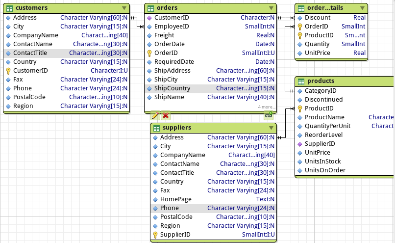

BSM211 Veritabanı Yönetim Sistemleri - Celal ÇEKEN, İsmail ÖZTEL, Veysel Harun ŞAHİN

# İleri SQL(Alt Sorgular, IN, ANY, ALL, İlintili Sorgular, UNION, INTERSECT, EXCEPT, Hareket/İşlem (Transaction))

## Konular

* Alt Sorgu
* UNION ve UNION ALL
* INTERSECT
* EXCEPT
* Hareket/İşlem (Transaction)

## Alt Sorgu

* Burada verilen örnekler NorthWind veritabanının aşağıdaki şeması ile ilgilidir.

### WHERE ile Alt Sorgu (Tek Değer Döndüren) Kullanımı 

* WHERE ifadesinde yalnızca =, !=, <, >, <=, >= gibi operatörler kullanılıyor ise alt sorgular sonucunda tek alan ve tek satır dönmeli ve veri tipi uygun olmalı. Aksi halde hata verir.

* Çoklu satır fonksiyonlarından geriye tek değer döndürüldüğü için alt sorgu içerisinde bu tür fonksiyonlar kullanılabilir.

* Alt sorgudaki koşul içerisinde birincil anahtar kullanılarak alt sorgudan tek değer döndürülmesi garanti edilebilir.

~~~sql
SELECT AVG("UnitPrice") FROM "products";
~~~

~~~sql
SELECT "ProductID", "UnitPrice" FROM "products"
WHERE "UnitPrice" < (SELECT AVG("UnitPrice") FROM "products");
~~~

~~~sql
SELECT "ProductID" FROM "products" WHERE "ProductName" = 'Y Z Bilgisayar';
~~~

~~~sql
SELECT DISTINCT "public"."customers"."CustomerID",
  "public"."customers"."CompanyName",
  "public"."customers"."ContactName"
FROM "orders"
INNER JOIN "customers" ON "orders"."CustomerID" = "customers"."CustomerID"
INNER JOIN "order_details" ON "order_details"."OrderID" = "orders"."OrderID"
WHERE "order_details"."ProductID" =
  (SELECT "ProductID" FROM "products" WHERE "ProductName" = 'Y Z Bilgisayar')
ORDER BY "public"."customers"."CustomerID";
~~~

### WHERE ile Alt Sorgu (Çok Değer Döndüren) Kullanımı 

* Alt sorgudan çok değer dönmesi durumunda IN, ANY ve ALL ifadeleri kullanılmalıdır.

* IN ifadesi, sorgulanan değerin, alt sorgudan dönen değerler kümesi içerisinde olup olmadığını araştırmak için kullanılır.

~~~sql
SELECT "SupplierID" FROM "products" WHERE "UnitPrice" > 18;
~~~

~~~sql
SELECT * FROM "suppliers"
WHERE "SupplierID" IN
  (SELECT "SupplierID" FROM "products" WHERE "UnitPrice" > 18);
~~~

~~~sql
SELECT "ProductID" FROM "products" WHERE "ProductName" LIKE 'A%';
~~~

~~~sql
SELECT DISTINCT "public"."customers"."CustomerID",
  "public"."customers"."CompanyName",
  "public"."customers"."ContactName"
FROM "orders"
INNER JOIN "customers" ON "orders"."CustomerID" = "customers"."CustomerID"
INNER JOIN "order_details" ON "order_details"."OrderID" = "orders"."OrderID"
WHERE "order_details"."ProductID" IN
  (SELECT "ProductID" FROM "products" WHERE "ProductName" LIKE 'A%');
~~~

~~~sql
UPDATE "orders"
SET "ShipCountry" = 'Mexico'
WHERE "CustomerID" IN
  (SELECT "CustomerID" FROM "customers" WHERE "Country" = 'Mexico');
~~~

~~~sql
DELETE FROM "products"
WHERE "SupplierID" IN
  (SELECT "SupplierID" FROM "suppliers" WHERE "Country" = 'USA');
~~~

### ANY ile Alt Sorgu Kullanımı

* Üç türü mevcuttur.
  + = ANY
  + \> ANY
  + < ANY

* = ANY ifadesi, sorgulanan değerin, alt sorgudan dönen değerler kümesinin elemanlarından her hangi birisine eşit olup olmadığını araştırmak için kullanılır.

* \> ANY ifadesi, sorgulanan değerin, alt sorgudan dönen değerler kümesinin elemanlarının her hangi birisinden büyük olup olmadığını araştırmak için kullanılır.

* < ANY ifadesi, sorgulanan değerin, alt sorgudan dönen değerler kümesinin elemanlarının her hangi birisinden küçük olup olmadığını araştırmak için kullanılır.

~~~sql  
SELECT * FROM "products"
WHERE "UnitPrice" = ANY
(
    SELECT "UnitPrice"
    FROM "suppliers"
    INNER JOIN "products"
    ON "suppliers"."SupplierID" = "products"."SupplierID"
    WHERE "suppliers"."CompanyName" = 'Tokyo Traders'
);
~~~

~~~sql
SELECT * FROM "products"
WHERE "UnitPrice" IN
(
    SELECT "UnitPrice"
    FROM "suppliers"
    INNER JOIN "products"
    ON "suppliers"."SupplierID" = "products"."SupplierID"
    WHERE "suppliers"."CompanyName" = 'Tokyo Traders'
);
~~~

~~~sql
SELECT * FROM "products"
WHERE "UnitPrice" < ANY
(
    SELECT "UnitPrice"
    FROM "suppliers"
    INNER JOIN "products"
    ON "suppliers"."SupplierID" = "products"."SupplierID"
    WHERE "suppliers"."CompanyName" = 'Tokyo Traders'
);
~~~

~~~sql
SELECT * FROM "products"
WHERE "UnitPrice" > ANY 
(
    SELECT "UnitPrice" 
    FROM "suppliers"
    INNER JOIN "products" 
    ON "suppliers"."SupplierID" = "products"."SupplierID"
    WHERE "suppliers"."CompanyName" = 'Tokyo Traders'
);
~~~

### ALL ile Alt Sorgu Kullanımı

* İki türü mevcuttur.
  + \> ALL
  + < ALL

* \> ALL ifadesi, sorgulanan değerin, alt sorgudan dönen değerler kümesinin elemanlarının tamamından büyük olup olmadığını araştırmak için kullanılır.

* < ALL ifadesi, sorgulanan değerin, alt sorgudan dönen değerler kümesinin elemanlarının tamamından küçük olup olmadığını araştırmak için kullanılır.

~~~sql
SELECT * FROM "products"
WHERE "UnitPrice" < ALL
(
    SELECT "UnitPrice"
    FROM "suppliers"
    INNER JOIN "products"
    ON "suppliers"."SupplierID" = "products"."SupplierID"
    WHERE "suppliers"."CompanyName" = 'Tokyo Traders'
);
~~~

~~~sql
SELECT * FROM "products"
WHERE "UnitPrice" > ALL 
(
    SELECT "UnitPrice" 
    FROM "suppliers"
    INNER JOIN "products" 
    ON "suppliers"."SupplierID" = "products"."SupplierID"
    WHERE "suppliers"."CompanyName" = 'Tokyo Traders'
);
~~~

### HAVING ile Alt Sorgu Kullanımı 

~~~sql
SELECT AVG("UnitsInStock") FROM "products";
~~~

~~~sql
SELECT "SupplierID", SUM("UnitsInStock") AS "stoktakiToplamUrunSayisi"
FROM  "products"
GROUP BY "SupplierID"
HAVING SUM("UnitsInStock") < (SELECT AVG("UnitsInStock") FROM "products");
~~~

~~~sql
SELECT MAX("Quantity") FROM "order_details";
~~~

~~~sql
SELECT "ProductID", SUM("Quantity")
FROM "order_details"
GROUP BY "ProductID"
HAVING SUM("Quantity") > (SELECT MAX("Quantity") FROM "order_details");
~~~

### Satır İçi (Inline) Alt Sorgu Kullanımı

* Alt sorgular sonucunda tek alan ve tek satır dönmeli. Aksi halde hata verir.

~~~sql
SELECT
  "ProductName",
  "UnitsInStock",
  (SELECT MAX("UnitsInStock") FROM "products") AS "enBuyukDeger"
FROM "products";
~~~

~~~sql
SELECT
  "SupplierID",
  SUM("UnitsInStock") AS "toplam",
  SQRT(SUM(("UnitsInStock" - (SELECT AVG("UnitsInStock") FROM "products")) ^ 2) / COUNT("UnitsInStock"))  AS "standartSapma"
FROM "products"
GROUP BY "SupplierID";
~~~

* Standart sapma hesaplanırken “Toplam” takma ismi kullanılmamalı.

### İlintili (Correlated) Sorgu 

* İç içe döngülerdeki gibi dış sorgunun her bir satırı iç sorguya gönderilerek iç sorgunun çalıştırılması sağlanır.

* Aşağıdaki örneğin çalışması şu adımlardan oluşur;
  + 1. Dış sorgunun birinci satırı seçilir.
  + 2. İç sorgu çalıştırılır ve dış sorguda seçilen satırın SupplierID değerine sahip olan tüm kayıtların UnitPrice alanlarındaki değerlerin aritmetik ortalaması hesaplanır.
  + 3. Dış sorgunun birinci satırının UnitPrice alanındaki değer, alt sorguda hesaplanan ortalamadan büyük ise seçilen birinci satır sonuç kümesine eklenir. Değilse eklenmez.
  + 4. Dış sorgunun ikinci satırı seçilir ve aynı işlem yapılır.
  + 5. Bu işlemler dış sorgunun tüm satırları için tekrarlanır.

~~~sql  
SELECT "ProductName", "UnitPrice" FROM "products" AS "urunler1"
WHERE "urunler1"."UnitPrice" >
(
  SELECT AVG("UnitPrice") FROM "products" AS "urunler2"
  WHERE "urunler1"."SupplierID" = "urunler2"."SupplierID"
);
~~~

* EXIST ifadesi ile birlikte başarımı çok iyidir.
  + Siparişi olan müşterilerin listesi.

* Alt sorgudaki * ifadesi yerine herhangi bir alan adı da yazılabilir.

~~~sql
SELECT "CustomerID", "CompanyName", "ContactName"
FROM "customers"
WHERE EXISTS
  (SELECT * FROM "orders" WHERE "customers"."CustomerID" = "orders"."CustomerID");
~~~

* Aynı sonuç farklı sorgular ile de bulunabilir. Ancak daha yavaş olur.

~~~sql
SELECT "CustomerID", "CompanyName", "ContactName"
FROM "customers"
WHERE "CustomerID" =
  (SELECT DISTINCT "CustomerID" FROM "orders" WHERE "orders"."CustomerID" = "customers"."CustomerID");
~~~

~~~sql
SELECT "CustomerID", "CompanyName", "ContactName"
FROM "customers"
WHERE "CustomerID" IN
  (SELECT "CustomerID" FROM "orders" WHERE "orders"."CustomerID" = "customers"."CustomerID");
~~~

~~~sql
SELECT DISTINCT "public"."customers"."CompanyName",
  "public"."customers"."ContactName"
FROM "orders" 
INNER JOIN "customers"  ON "orders"."CustomerID" = "customers"."CustomerID";
~~~

* Siparişi olmayan müşterilerin listesi.

~~~sql
SELECT "CustomerID", "CompanyName", "ContactName"
FROM "customers"
WHERE NOT EXISTS
  (SELECT * FROM "orders" WHERE "customers"."CustomerID" = "orders"."CustomerID");
~~~

## UNION ve UNION ALL 

* İki tablonun küme birleşimini alır.
* Rastgele iki tablonun birleşimi alınamaz.
  + İki tablonun nitelik sayıları aynı olmalı.
  + Aynı sıradaki nitelikleri aynı değer alanı üzerinde tanımlanmış olmalıdır.
* UNION ifadesi ile aynı kayıtlar bir defa gösterilir.
* UNION ALL ifadesi ile aynı kayıtlar gösterilir.

~~~sql
SELECT "CompanyName", "Country" FROM "customers"
UNION 
SELECT "CompanyName", "Country" FROM "suppliers"
ORDER BY 2;
~~~

~~~sql
SELECT "CompanyName", "Country" FROM "customers"
UNION ALL
SELECT "CompanyName", "Country" FROM "suppliers"
ORDER BY 2;
~~~

~~~sql
SELECT "CustomerID" FROM "customers"
UNION
SELECT "CustomerID" FROM "orders"
ORDER BY "CustomerID";
~~~

## INTERSECT 

* İki tablonun küme kesişimi elde edilir.
* Rasgele iki tablonun kesişimi alınamaz.
  + İki tablonun nitelik sayıları aynı olmalı. 
  + Aynı sıradaki nitelikleri aynı değer alanı üzerinde tanımlanmış olmalı.  

~~~sql
SELECT "CompanyName", "Country" FROM "customers"
INTERSECT
SELECT "CompanyName", "Country" FROM "suppliers"
ORDER BY 2;
~~~

## EXCEPT

* Bir tablonun diğerinden farkını elde etmek için kullanılır.
* Rastgele iki tabloya uygulanamaz.
  + İki tablonun nitelik sayıları aynı olmalı.
  + Aynı sıradaki nitelikleri aynı değer alanı üzerinde tanımlanmış olmalı.  

~~~sql
SELECT "CompanyName", "Country" FROM "customers"
EXCEPT
SELECT "CompanyName", "Country" FROM "suppliers"
ORDER BY 2;
~~~

## Hareket/İşlem (Transaction)

* Hareket/işlem (transaction) veritabanı yönetim sistemlerinin önemli özelliklerinden birisidir.

* ACID ile belirtilen ozellikleri destekler.

* ACID ifadesi, Atomicity, Consistency, Isolation ve Durability kelimelerinin ilk harflerinin birleşiminden oluşur. Detayları aşağıda anlatılmıştır.

* Atomicity (Atomiklik): Hareket/işlem (transaction) kapsamındaki alt işlemlerin tamamı bir bütün olarak ele alınır. Ya alt işlemlerin tamamı başarılı olarak çalıştırılır, ya da herhangi birinde hata varsa tamamı iptal edilir ve veritabanı eski kararlı haline döndürülür. 

* Consistency (Tutarlılık): Herhangi bir kısıt ihlal edilirse roll back işlemiyle veritabanı eski kararlı haline döndürülür.

* Isolation (Yalıtım): İşlemler birbirlerini (ortak kaynak kullanımı durumunda) etkilemezler. Kullanılan ortak kaynak işlem tarafından, işlem tamamlanana kadar, kilitlenir.

* Durability (Mukavemet): Sistem tarafından bir hata meydana gelmesi durumunda tamamlanmamış olan işlem sistem çalışmaya başladıktan sonra mutlaka tamamlanır.

~~~sql
BEGIN; -- Harekete (transaction) başla.

INSERT INTO "order_details" ("OrderID", "ProductID", "UnitPrice", "Quantity", "Discount")
VALUES (10248, 11, 20, 2, 0);

-- Yukarıdaki sorguda hata mevcutsa ilerlenilmez.
-- Aşağıdaki sorguda hata mevcutsa bu noktadan geri sarılır (rollback).
-- Yani yukarıdaki sorguda yapılan işlemler geri alınır.

UPDATE "products" 
SET "UnitsInStock" = "UnitsInStock" - 2
WHERE "ProductID" = 11;

-- Her iki sorgu da hatasız bir şekilde icra edilirse her ikisini de işlet ve 
-- veritabanının durumunu güncelle.

COMMIT; -- Hareketi (transaction) tamamla.
~~~

~~~sql
BEGIN;

UPDATE Hesap SET bakiye = bakiye - 100.00
    WHERE adi = 'Ahmet';

SAVEPOINT my_savepoint;

UPDATE Hesap SET bakiye = bakiye + 100.00
    WHERE adi = 'Mehmet';

-- Parayı Mehmet'e değil Ayşe'ye gönder

ROLLBACK TO my_savepoint;

UPDATE Hesap SET bakiye = bakiye + 100.00
WHERE adi = 'Ayşe';

COMMIT;
~~~
